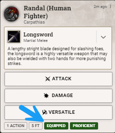
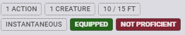

[TGCE] Restyler for DnD5e 3.0

This module allows for restyling of some of the DnD5e System components for Foundry VTT. Creating this module would not have been possible without the wonderful people who haunt the various channels of the Official Foundry VTT Discord Server. Thanks, to you all. 

Player Character Sheet

The navigation tabs have been relocated to the character sheet header and dressed up a bit. 
The 

 

- Chat Cards

Tools/Skills toggle. This was all Zhell. Thanks!

 

Chatcard Pill color highlights. This was all Ichabod. Thanks!

 