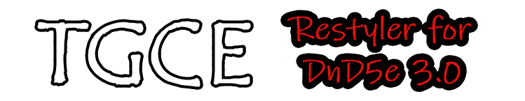

# Resources and tools helping DMs and Players acheive The Greatest Campaign Ever!

# [TGCE] Restyler for DnD5e 3.0

This module allows for restyling of some of the DnD5e System components for Foundry VTT. 
Creating this module would not have been possible without the wonderful people who haunt the various channels of the Official Foundry VTT Discord Server. 

Thanks, to you all. 

## Player Character Sheet Visual Enhancements

 

- The entire character sheet is scalable from .8 (80% of default) to 1 (default)
- The navigation tabs have been relocated to the character sheet header and dressed up a bit.
  - As of v1.2.0 this is now optional.     
- The header image can be replaced, or removed.
- The header background color can be selected.
  - This is typically buried under the image, but if the image is removed, or one with transparency is used, the color will be visible.
- Some header text elements can be colored.
- Hue-Rotation: A color filter can be applied to the entire header, affecting all elements, using the hue-rotation method.
- On other tabs of the sheet (Inventory/Spells, etc..) the section banners (Weapons, Consumables, etc..) on can be color changes, as well as the section header text. 
  - https://www.w3schools.com/cssref/playdemo.php?filename=playcss_filter&preval=hue-rotate(90deg) for an example

## Player Character Sheet Functional Enhancements

 

- A button is added to the skill tree to toggle between skill and tools, reducing overall shett height. Especially on higher level characters with many tool proficiencies.

## Chatcard Pill color highlights.

- The chat pills for profieicy and equipped status will be color coded. These are currently color coded green/maroon, but in a future release will be selectable to account for color blindness.
- Concentration pill is colored yellow with black text to be more visible. 

## Provided sheet banners

- The following four images, sized at 800x170 pixels, can be found in the modules/tgce-restyler-5e3/assets folder. You will have to manually navigate to the location using the file picker. This location will be set as default in a future release. 

All of these pictures are proprietary content created by myself. 

### Additional Examples
- The picture below uses only the Hue Rotation option to adjust the coloring of the header on an otherwise stock DnD5e character sheet.

